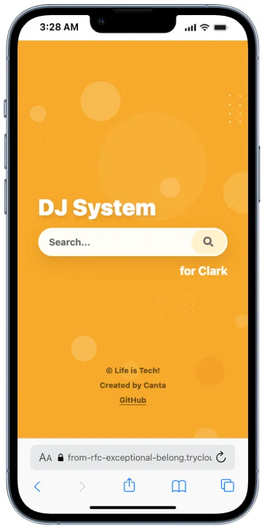
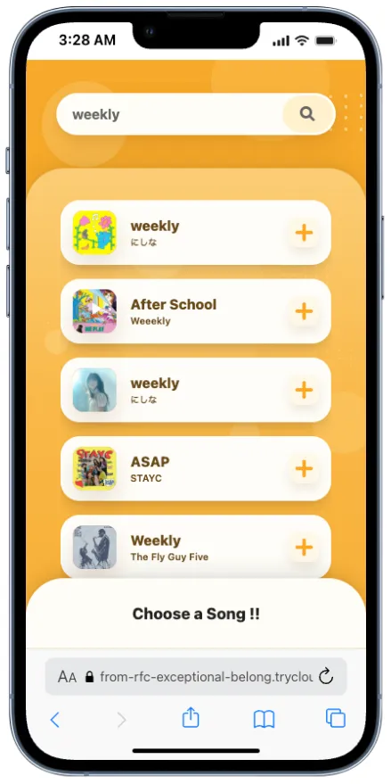
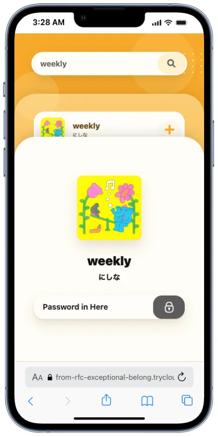

# DJ Request App

Search Spotify tracks and add them to a playlist after password confirmation.

## Pages

<p>
  
  
  
</p>

## Setup

```sh
make setup
```

Set `.env`.

```env
SPOTIFY_CLIENT_ID=...
SPOTIFY_CLIENT_SECRET=...
SPOTIFY_REFRESH_TOKEN=...
SPOTIFY_PLAYLIST_ID=...
MENTOR_PASSWORD=...
```

`SPOTIFY_REFRESH_TOKEN` needs one of:

```txt
playlist-modify-public
playlist-modify-private
```

## Share

```sh
make
```

Send the printed `https://...trycloudflare.com` URL or
`tools/output/share-qr.png`.

`make` updates the QR image after the public URL is issued.

```sh
make qr URL=https://example.trycloudflare.com
```

## Stop

```sh
make down
```

## Check

```sh
make check
```

## Files

```txt
frontend/      UI
backend/       API
tools/         Local utilities and generated share assets
compose.yaml   Docker + Cloudflare Tunnel
Makefile       Commands
```
