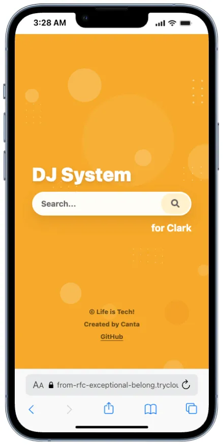
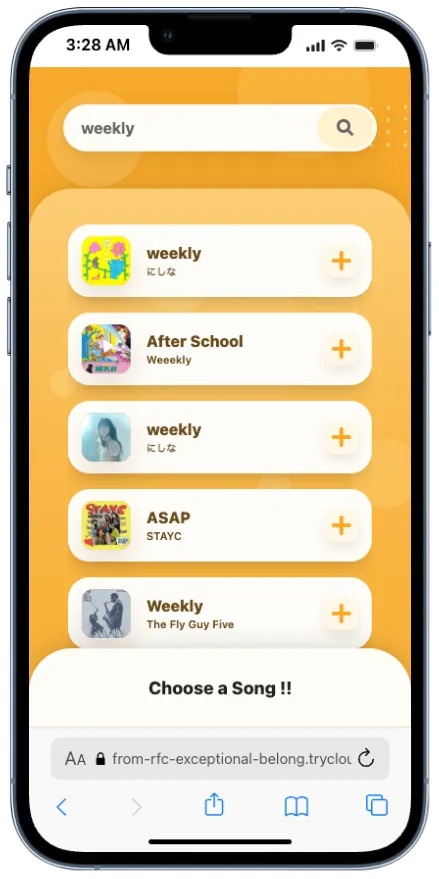
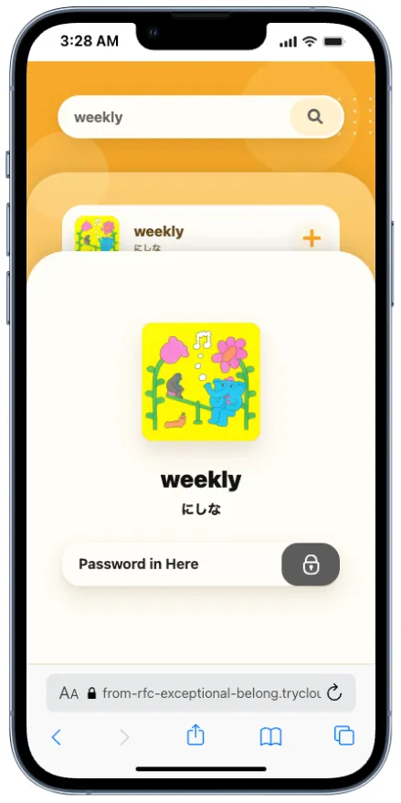

# DJ Request App

Search Spotify tracks and add them to a playlist after password confirmation.

The public UI keeps the existing confirmation flow. The authenticated admin page
at `/admin` controls requests and shows the current playback and up to 50
playlist items.

## Pages

<p>
  
  
  
</p>

## Local Setup

```sh
npm install
```

Set `.env` for local development.

```env
SPOTIFY_CLIENT_ID=...
SPOTIFY_CLIENT_SECRET=...
SPOTIFY_REFRESH_TOKEN=...
SPOTIFY_PLAYLIST_ID=...
MENTOR_PASSWORD=...
ADMIN_SESSION_SECRET=...
UPSTASH_REDIS_REST_URL=...
UPSTASH_REDIS_REST_TOKEN=...
```

`ADMIN_SESSION_SECRET` signs the admin session cookie. Use a long random value.
The Upstash values enable request control and password changes from `/admin`.
Without them, requests stay open and `MENTOR_PASSWORD` remains active.

`SPOTIFY_REFRESH_TOKEN` needs:

```txt
playlist-modify-public
playlist-modify-private
playlist-read-private
user-read-currently-playing
user-read-playback-state
```

## Refresh Token

Register this redirect URI in the Spotify Developer Dashboard:

```txt
http://[::1]:5000/callback
```

Then run:

```sh
python3 -m venv .venv
. .venv/bin/activate
python3 -m pip install -r tools/requirements-auth.txt
python3 tools/auth_server.py
```

The script reads `SPOTIFY_CLIENT_ID` and `SPOTIFY_CLIENT_SECRET` from `.env`.
Open `http://[::1]:5000/login`, authorize Spotify, and copy the returned
refresh token to `.env`.

## Local Development

```sh
npm run local
```

This starts the static frontend and API Functions with values from `.env`
without linking a Vercel project.

To test with the Vercel Development environment variables instead, run:

```sh
npm run link
npx vercel pull
npx vercel dev
```

Open `http://localhost:3000/` for the public UI and
`http://localhost:3000/admin` for the admin UI.

## Vercel

Import this repository into Vercel and add the values from `.env.example` to the
Production environment variables. Vercel serves the existing UI and the API
Functions in `api/` without a persistent application server.

```txt
/        public request UI
/admin   authenticated playback and playlist view
```

The configured Spotify playlist must be owned by, or collaborative with, the
account that issued `SPOTIFY_REFRESH_TOKEN` for its items to be available.

Install an Upstash Redis integration from the Vercel Marketplace and connect it
to the project. Vercel adds `UPSTASH_REDIS_REST_URL` and
`UPSTASH_REDIS_REST_TOKEN` automatically. Add it separately to Preview and
Production when both environments need admin settings.

## Check

```sh
npm run check
```

## Files

```txt
frontend/      UI
api/           Vercel Functions
tests/         API tests
tools/         Spotify refresh token utility
vercel.json    Vercel routes and Functions configuration
```
